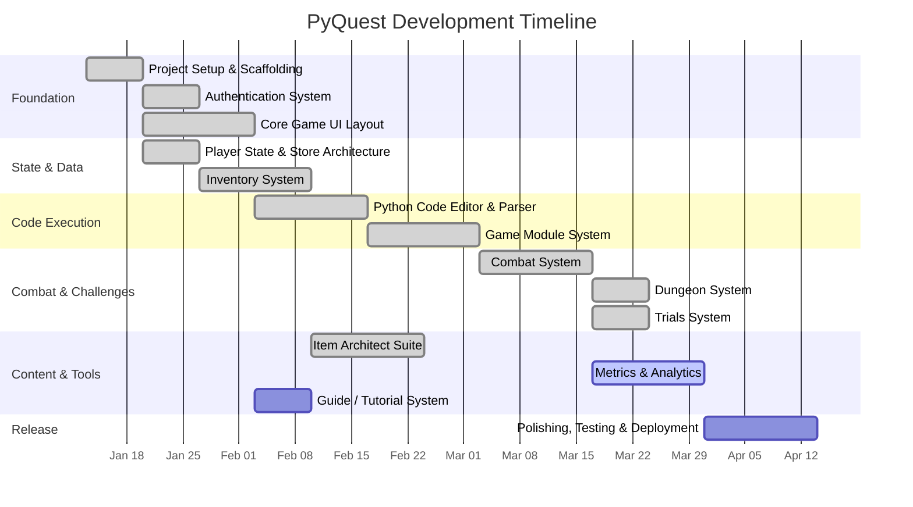
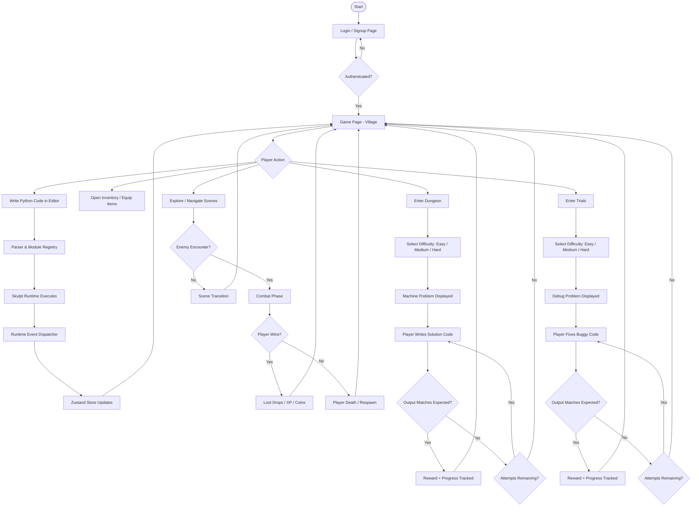
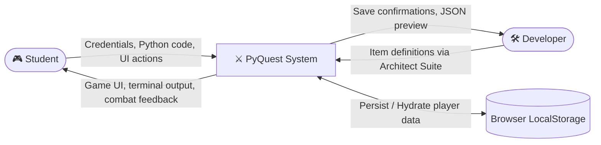
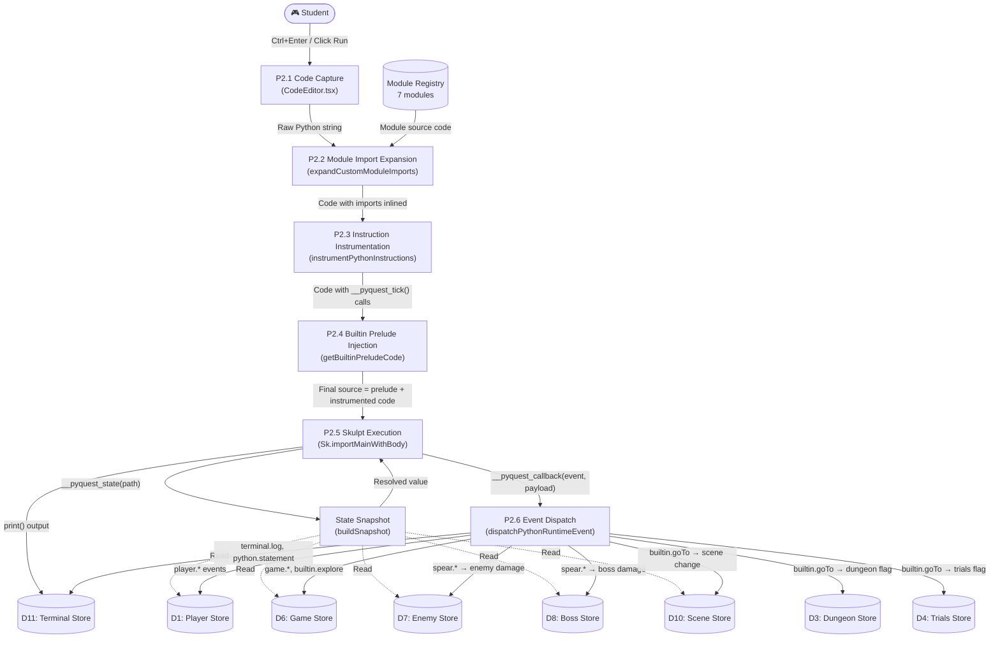
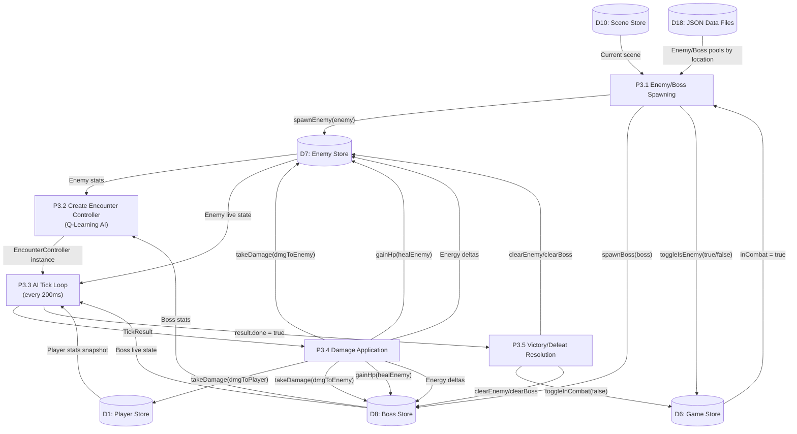
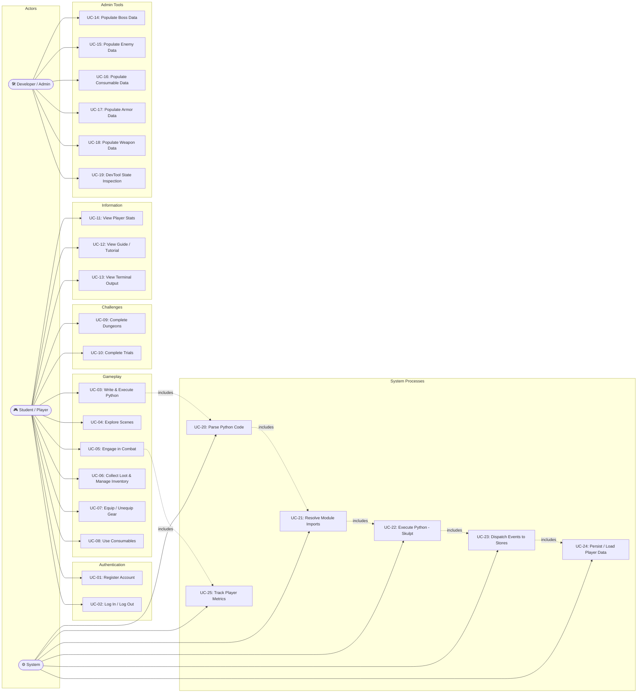

# PyQuest — Graph & Diagram Plan

This document plans out the diagrams to be generated for the PyQuest project documentation. Each section specifies the diagram type, its purpose, the data/components it will cover, and the tool or format to render it in.

---

## 1. Gantt Chart

**Purpose:** Show the project development timeline, breaking the work into phases with estimated durations and dependencies.

**Tool:** Mermaid (`gantt` syntax), or a dedicated tool such as Microsoft Project / Google Sheets / draw.io.

### Phases to Include

| # | Phase | Approx Duration | Dependencies |
|---|-------|-----------------|--------------|
| 1 | Project Setup & Scaffolding | Week 1 | — |
| 2 | Authentication System | Week 2 | Phase 1 |
| 3 | Core Game UI Layout | Weeks 2–3 | Phase 1 |
| 4 | Player State & Store Architecture | Week 3 | Phase 1 |
| 5 | Inventory System | Weeks 3–4 | Phase 4 |
| 6 | Python Code Editor & Parser | Weeks 4–5 | Phase 3 |
| 7 | Game Module System (builtin, abstracts, spear, magic, etc.) | Weeks 5–6 | Phase 6 |
| 8 | Combat System (Enemies, Bosses, Damage) | Weeks 6–7 | Phases 4, 7 |
| 9 | Dungeon & Trials System | Weeks 7–8 | Phase 8 |
| 10 | Item Architect Suite (Boss/Enemy/Consumable/Armor/Weapon) | Weeks 8–9 | Phases 5, 8 |
| 11 | Metrics & Analytics Tracking | Weeks 9–10 | Phases 4, 8, 9 |
| 12 | Guide / Tutorial System | Week 10 | Phase 3 |
| 13 | Polishing, Testing & Deployment | Weeks 10–12 | All |

### Mermaid Draft

---

## 2. Flowchart

**Purpose:** Visualize the primary user gameplay loop — from login to playing, coding, fighting, and looting.

**Tool:** Mermaid (`flowchart` syntax) or draw.io.

### Key Flows to Cover

1. **Authentication Flow** — Login / Signup → Session Hydration → Redirect to `/game`
2. **Main Game Loop** — Village → Explore → Encounter (Enemy/Boss) → Combat → Loot → Return
3. **Code Execution Flow** — Player writes Python → Parser tokenizes → Module registry resolves imports → Skulpt runtime executes → Callbacks emitted → Zustand stores update
4. **Dungeon Flow** — Enter Dungeon → Select Difficulty → Machine Problem displayed → Code → Validate output → Attempt tracking → Rewards
5. **Trials Flow** — Enter Trials → Select Difficulty → Debug Problem displayed → Fix code → Validate → Rewards

### Mermaid Draft — Main Game Loop

---

## 3. Data Flow Diagram (DFD)

**Purpose:** Show how data moves through the PyQuest system — from user input to state stores to the UI rendering layer.

**Tool:** Mermaid (`flowchart` syntax adapted for DFD), draw.io, or Lucidchart.

---

### 3.1 Context Diagram (Level 0)

The highest-level view. Shows PyQuest as a single process with all external entities.

#### External Entities

| Entity | Role | Data Sent | Data Received |
|--------|------|-----------|---------------|
| **Student (Player)** | Primary user | Login credentials, Python source code, UI interactions (navigate, equip, use items) | Game visuals, terminal output, inventory state, combat feedback, stats display |
| **Developer / Admin** | Content creator | Item definitions (boss/enemy/consumable/armor/weapon attributes, stats, images) | Save confirmation, JSON preview |
| **Browser LocalStorage** | Persistent data store | Read requests (hydration on page load) | Player session, inventory tree, dungeon progress, trials progress, metrics data |

#### Mermaid Draft — Context Diagram

---

### 3.2 Level 1 DFD — Major Processes

Decomposes the PyQuest system into its 8 major processes and the data stores they interact with.

#### Processes

| Process # | Process Name | Source File(s) | Description |
|-----------|-------------|----------------|-------------|
| P1 | **Authentication** | `authService.ts`, `LoginPage.tsx`, `SignupPage.tsx` | Validates credentials against LocalStorage, creates new user records, hydrates player session |
| P2 | **Python Code Execution** | `CodeEditor.tsx`, `parser.ts`, `module-registry.ts`, `zustand-runtime.ts`, `runtime-event-dispatcher.ts` | Full pipeline from player typing code to game state mutations |
| P3 | **Combat System** | `Combat.tsx`, `EnemyEncounter.tsx`, `BossEncounter.tsx`, `encounter.ts`, `actions.ts`, `qlearning.ts` | Manages enemy/boss spawning, AI decision-making, damage calculation, loot rewards |
| P4 | **Dungeon Challenges** | `Dungeon.tsx`, `dungeonStore.ts` | Machine problem presentation, output validation, attempt tracking, difficulty-based progression |
| P5 | **Trials Challenges** | `Trials.tsx`, `trialsStore.ts` | Debug problem presentation, code-fix validation, attempt tracking, difficulty-based progression |
| P6 | **Inventory Management** | `LeftSideBar.tsx`, `RightSideBar.tsx`, `inventoryStore.ts` | Tree-structured item storage, drag-and-drop, loot transfer, equip/unequip |
| P7 | **Metrics Tracking** | `metricsStore.ts` | Records playtime, deaths, errors, coins, XP, enemies/bosses defeated — all per-level |
| P8 | **Content Authoring** | `UnifiedArchitect.tsx`, `dev-server.cjs` | Developer tool for populating game data JSON files via form UI |

#### Data Stores

| Store ID | Store Name | Source File | Persistence | LocalStorage Key Pattern |
|----------|-----------|-------------|-------------|--------------------------|
| D1 | Player Store | `playerStore.ts` | ✅ Persisted | `pyquest-active-session` |
| D2 | Inventory Store | `inventoryStore.ts` | ✅ Persisted | `player-inventory-{userId}` |
| D3 | Dungeon Store | `dungeonStore.ts` | ✅ Persisted | `player-dungeon-{userId}` |
| D4 | Trials Store | `trialsStore.ts` | ✅ Persisted | `player-trials-{userId}` |
| D5 | Metrics Store | `metricsStore.ts` | ✅ Persisted | `metrics-{playerId}` |
| D6 | Game Store | `gameStore.ts` | ❌ Memory | — |
| D7 | Enemy Store | `enemyStore.ts` | ❌ Memory | — |
| D8 | Boss Store | `bossStore.ts` | ❌ Memory | — |
| D9 | Consumable Store | `consumableStore.ts` | ❌ Memory | — |
| D10 | Scene Store | `sceneStore.ts` | ❌ Memory | — |
| D11 | Terminal Store | `terminalStore.ts` | ❌ Memory | — |
| D12 | Weapon Store | `weaponStore.ts` | ❌ Memory | — |
| D13 | Armor Store | `armorStore.ts` | ❌ Memory | — |
| D14 | Guide Store | `guideStore.ts` | ❌ Memory | — |
| D15 | NPC Store | `npcStore.ts` | ❌ Memory | — |
| D16 | DevTool Store | `devToolStore.ts` | ❌ Memory | — |
| D17 | User Credentials | `authService.ts` | ✅ Persisted | `user-{username}` |
| D18 | JSON Data Files | `src/game/json/*.json` | ✅ On disk | — (bundled at build time) |

#### Mermaid Draft — Level 1 DFD

```mermaid
flowchart TB
    Student([🎮 Student])
    Admin([🛠️ Developer])

    subgraph "P1: Authentication"
        Auth[P1 - Authenticate User]
    end

    subgraph "P2: Python Code Execution"
        CodeExec[P2 - Execute Python Code]
    end

    subgraph "P3: Combat System"
        Combat[P3 - Run Combat]
    end

    subgraph "P4: Dungeon Challenges"
        Dungeon[P4 - Process Dungeon]
    end

    subgraph "P5: Trials Challenges"
        Trials[P5 - Process Trials]
    end

    subgraph "P6: Inventory Management"
        Inv[P6 - Manage Inventory]
    end

    subgraph "P7: Metrics Tracking"
        Metrics[P7 - Track Metrics]
    end

    subgraph "P8: Content Authoring"
        Architect[P8 - Author Content]
    end

    D1[(D1: Player Store)]
    D2[(D2: Inventory Store)]
    D3[(D3: Dungeon Store)]
    D4[(D4: Trials Store)]
    D5[(D5: Metrics Store)]
    D6[(D6: Game Store)]
    D7[(D7: Enemy Store)]
    D8[(D8: Boss Store)]
    D10[(D10: Scene Store)]
    D11[(D11: Terminal Store)]
    D17[(D17: User Credentials)]
    D18[(D18: JSON Data Files)]

    %% P1 Authentication
    Student -->|"username, password"| Auth
    Auth -->|"Read/Write credentials"| D17
    Auth -->|"Set userId, username"| D1
    Auth -->|"Trigger hydration"| D2
    Auth -->|"Redirect to /game"| Student

    %% P2 Code Execution
    Student -->|"Python source code"| CodeExec
    CodeExec -->|"Print output, errors"| D11
    CodeExec -->|"goTo, scavenge, explore events"| D6
    CodeExec -->|"gain_hp, take_damage, gain_coins, gain_xp"| D1
    CodeExec -->|"Scene change"| D10
    CodeExec -->|"Damage to enemy"| D7
    CodeExec -->|"Damage to boss"| D8
    CodeExec -->|"Dungeon/Trials flags"| D3 & D4

    %% P3 Combat
    D18 -->|"Enemy/Boss definitions"| Combat
    Combat -->|"Spawn enemy"| D7
    Combat -->|"Spawn boss"| D8
    Combat -->|"Damage to player"| D1
    Combat -->|"Combat state flags"| D6
    Combat -->|"Loot rewards"| D1
    Combat -->|"Track kills"| Metrics

    %% P4 Dungeon
    Student -->|"Select difficulty, submit code"| Dungeon
    Dungeon -->|"Read/Write progress"| D3
    Dungeon -->|"Reward coins, XP"| D1
    Dungeon -->|"Track errors"| Metrics

    %% P5 Trials
    Student -->|"Select difficulty, fix code"| Trials
    Trials -->|"Read/Write progress"| D4
    Trials -->|"Reward coins, XP"| D1
    Trials -->|"Track errors"| Metrics

    %% P6 Inventory
    Student -->|"Add, delete, rename, move items"| Inv
    Inv -->|"Read/Write inventory tree"| D2
    Inv -->|"Equip weapon/armor"| D1

    %% P7 Metrics
    D1 & D3 & D4 -->|"Game events"| Metrics
    Metrics -->|"Read/Write metrics"| D5

    %% P8 Content Authoring
    Admin -->|"Item form data"| Architect
    Architect -->|"Write JSON"| D18
```

#### Level 1 — Data Flow Table (Complete)

| # | From | To | Data Description | Trigger |
|---|------|----|------------------|---------|
| F1.1 | Student | P1 | `{username, password}` | Login/Signup form submit |
| F1.2 | P1 | D17 | `{username, password}` as JSON | `localStorage.setItem('user-{username}', ...)` |
| F1.3 | P1 | D1 | `{user_id, username, password}` | `setUserId()`, `setUsername()` |
| F1.4 | P1 | D2 | Hydration trigger for `player-inventory-{userId}` | `loadInventoryProfile(userId)` |
| F2.1 | Student | P2 | Raw Python source code string | Click Run / Ctrl+Enter |
| F2.2 | P2 | D11 | Log lines: `[PY]: ...`, `[PY-OUT]: ...`, `[PY-ERR]: ...` | `appendToLog()` |
| F2.3 | P2 | D1 | HP delta, coin delta, XP delta, damage amount | Event dispatch: `player.*` events |
| F2.4 | P2 | D6 | `{inCombat, isEnemy, inVillage}` | Event dispatch: `game.*`, `builtin.goTo` |
| F2.5 | P2 | D10 | `{scene, sceneBg}` | Event dispatch: `builtin.goTo` |
| F2.6 | P2 | D7 / D8 | Damage amount | Event dispatch: `spear.*` events |
| F3.1 | D18 | P3 | Enemy/Boss definitions (stats, skills, loot tables) | `getEnemiesByLocation()`, `getBossesByLocation()` |
| F3.2 | P3 | D7 | Full enemy object via `spawnEnemy()` | Combat starts, enemy selected randomly |
| F3.3 | P3 | D8 | Full boss object via `spawnBoss()` | Combat starts, boss selected randomly |
| F3.4 | P3 | D1 | `takeDamage(amount)` — reduces player HP | AI tick: every 200ms interval |
| F3.5 | P3 | D7/D8 | `takeDamage(amount)`, `gainHp(amount)`, energy deltas | AI tick result applied |
| F4.1 | Student | P4 | Difficulty selection, solution code | Dungeon UI interaction |
| F4.2 | P4 | D3 | `{currEasy++, currMedium++, currHard++, currAttempt++}` | Problem solved or attempt used |
| F5.1 | Student | P5 | Difficulty selection, fixed code | Trials UI interaction |
| F5.2 | P5 | D4 | `{currEasy++, currMedium++, currHard++, currAttempt++}` | Problem solved or attempt used |
| F6.1 | Student | P6 | Item operations: add, delete, rename, move | Inventory UI drag-and-drop |
| F6.2 | P6 | D2 | Updated `playerInventory: InventoryNode[]` | Any inventory mutation |
| F7.1 | P3/P4/P5 | P7 | Game events (kills, errors, coins, XP, deaths) | Trigger function calls on metricsStore |
| F7.2 | P7 | D5 | Updated metrics per field | `saveMetricsToLocalStorage()` after each track call |
| F8.1 | Admin | P8 | Form data: item ID, name, stats, skills, loot tables, image paths | Architect form submit |
| F8.2 | P8 | D18 | JSON write: full item object appended to file | Express `POST /api/{type}` |

---

### 3.3 Level 2 DFD — Python Code Execution Pipeline (P2 Decomposed)

Breaks down the Python Code Execution process into its 6 sub-processes, showing exactly how code travels from the editor to game state updates.

#### Sub-Processes

| Sub-Process | Name | Source File | Input | Output |
|-------------|------|-------------|-------|--------|
| P2.1 | **Code Capture** | `CodeEditor.tsx` | Player keystroke (Ctrl+Enter) or Run button click | Raw Python string from Monaco editor |
| P2.2 | **Module Import Expansion** | `parser.ts` → `expandCustomModuleImports()` | Raw code with `import`/`from` statements | Code with custom module imports inlined as source text |
| P2.3 | **Instruction Instrumentation** | `parser.ts` → `instrumentPythonInstructions()` | Expanded code | Instrumented code with `__pyquest_tick()` calls injected before each statement |
| P2.4 | **Builtin Prelude Injection** | `parser.ts` → `getBuiltinPreludeCode()` | Instrumented code | Final source = prelude (builtin module code) + instrumented user code |
| P2.5 | **Skulpt Execution** | `parser.ts` → `runPython()` via Skulpt | Final source code | `print()` output string + `__pyquest_callback()` invocations |
| P2.6 | **Event Dispatch** | `runtime-event-dispatcher.ts` → `dispatchPythonRuntimeEvent()` | `PythonModuleCallEvent` objects | Zustand store mutations across multiple stores |

#### Available Game Modules (Loaded by P2.2 / P2.4)

| Module Name | Visibility | Prelude? | Description |
|-------------|-----------|----------|-------------|
| `builtin` | Internal | ✅ Yes | Auto-loaded helpers: `goTo()`, `gain_hp()`, `take_damage()`, `gain_coins()`, `gain_xp()`, `combat()`, `explore()`, `scavenge()`, `log()`, `sleep()`, `set_delay()` |
| `abstracts` | Internal | ❌ No | Class contracts: `Player`, `Enemy`, `Armor`, `Item`, `Spear`, `Entity` |
| `user.weapons` | Public | ❌ No | User-importable nested module: pre-instantiates `spear = Spear()` |
| `spear` | Public | ❌ No | `Spear` class with `attack()`, `thrust()`, `repair()`, `create_spear()` |
| `inventory` | Public | ❌ No | `Item` class, `add_item()`, `remove_item()`, `list_items()`, `get_total_value()` |
| `magic` | Public | ❌ No | `Spell` class, predefined spells (`FIREBALL`, `HEAL`, `LIGHTNING`, `SHIELD`), `cast_spell()` |
| `utils` | Public | ❌ No | `roll_dice()`, `chance()`, `random_choice()`, `clamp()` |

#### Runtime Bridge — Skulpt Built-in Functions

These are JavaScript functions injected into Skulpt's `builtins` namespace by `installRuntimeBridgeBuiltins()` in `parser.ts`:

| Skulpt Builtin | JS Implementation | Purpose |
|----------------|-------------------|---------|
| `__pyquest_callback(eventName, payload)` | Calls `runtimeHooks.onFunctionCall()` | Emits game events from Python to JS |
| `__pyquest_state(path, fallback)` | Calls `runtimeHooks.getStateValue()` → `buildSnapshot()` → `resolvePath()` | Reads live Zustand state from Python (e.g., `player.hp`, `enemy.name`) |
| `__pyquest_set_delay(ms)` | Updates `activeInstructionDelayMs` | Changes execution speed between statements |
| `__pyquest_sleep(ms)` | Returns `delayMs(ms)` promise | Pauses Python execution for specified time |
| `__pyquest_tick(lineNumber, statementType, explicitDelay?)` | Emits `python.statement` event + delays | Instrumentation hook for per-statement logging and pacing |

#### State Snapshot (Read by `__pyquest_state`)

When Python code calls `_state("player.hp")`, the runtime reads from this snapshot built by `zustand-runtime.ts` → `buildSnapshot()`:

| Path Prefix | Source Store | Available Fields |
|-------------|-------------|-----------------|
| `player.*` | `playerStore` | `hp`, `maxHP`, `def`, `maxDef`, `energy`, `maxEnergy`, `baseDmg`, `baseCritDmg`, `baseCritChance`, `atkSpeed`, `leftHand`, `rightHand`, `headSlot`, `bodySlot`, `coins`, `XP`, `level` |
| `game.*` | `gameStore` | `inVillage`, `isMerchant`, `isEnemy`, `inCombat`, `rightPanel` |
| `scene.*` | `sceneStore` | `scene`, `sceneBg` |
| `enemy.*` | `enemyStore` | `id`, `name`, `hp`, `maxHp`, `energy`, `maxEnergy`, `def`, `dmg`, `atkSpeed`, `critDmg`, `critChance`, `evasion`, `skills` |
| `boss.*` | `bossStore` | `id`, `name`, `hp`, `maxHp`, `energy`, `maxEnergy`, `def`, `dmg`, `atkSpeed`, `critDmg`, `critChance`, `evasion`, `skills` |
| `inventory.*` | `inventoryStore` | `player_id`, `playerInventory` |

#### Event Dispatch Mapping (Complete)

Full mapping of every event name emitted by Python code to the Zustand store mutation it triggers:

| # | Event Name | Payload Fields | Target Store(s) | Store Action | Source (Python) |
|---|-----------|---------------|-----------------|-------------|-----------------|
| E1 | `builtin.goTo` | `locationId: string` | D10 (Scene), D6 (Game), D3 (Dungeon), D4 (Trials) | `setScene()`, `setState({inVillage, inCombat})`, `setState({inDungeon})`, `setState({inTrials})` | `goTo("forest")` |
| E2 | `builtin.scavenge` | `coins: number` | D1 (Player) | `gainCoins(amount)` | `scavenge()` |
| E3 | `builtin.explore` | — | D6 (Game) | `toggleInCombat(true)` | `explore()` |
| E4 | `player.gain_hp` | `amount: number` | D1 (Player) | `gainHP(amount)` | `gain_hp(10)` / `player.gain_hp(10)` |
| E5 | `player.take_damage` | `amount: number` | D1 (Player) | `takeDamage(amount)`, `toggleIsDamaged(true)` | `take_damage(5)` / `player.take_damage(5)` |
| E6 | `player.gain_coins` | `amount: number` | D1 (Player) | `gainCoins(amount)` | `gain_coins(3)` / `player.gain_coins(3)` |
| E7 | `player.gain_xp` | `amount: number` | D1 (Player) | `gainXP(amount)` (auto level-up if threshold met) | `gain_xp(50)` / `player.gain_xp(50)` |
| E8 | `game.combat` | `state: boolean` | D6 (Game) | `toggleInCombat(state)` | `combat(True)` / `combat(False)` |
| E9 | `game.is_enemy` | `state: boolean` | D6 (Game) | `toggleIsEnemy(state)` | `target_enemy(True)` |
| E10 | `terminal.log` | `message: string` | D11 (Terminal) | `appendToLog("[PY]: " + message)` | `log("hello")` |
| E11 | `python.statement` | `lineNumber: int, statementType: string, delayMs: int` | D11 (Terminal) | `appendToLog("[TRACE] ...")` (if logging enabled) | Auto-injected by instrumentation |
| E12 | `spear.attack` | `damage: number` | D7 (Enemy) or D8 (Boss) | `takeDamage(damage)` — routed via `applyPlayerAttackDamage()` based on `isEnemy` flag | `spear.attack("target")` |
| E13 | `spear.attack.quick` | `damage: number` | D7 (Enemy) or D8 (Boss) | Same as E12 | `attack("target", 10)` |
| E14 | `spear.thrust` | `damage: number` | D7 (Enemy) or D8 (Boss) | Same as E12 | `spear.thrust("target")` |
| E15 | `spear.pierce` | `damage: number` | D7 (Enemy) or D8 (Boss) | Same as E12 | `spear.pierce()` |
| E16 | `player.equip` | `item: string` | — | No-op (handled elsewhere) | `player.equip(item)` |
| E17 | `player.unequip` | — | — | No-op (handled elsewhere) | `player.unequip()` |
| E18 | `spear.repair` | `amount: number, durability: number` | — | No-op (internal to Python) | `spear.repair(50)` |
| E19 | `spear.create` | `damage: number` | — | No-op (internal to Python) | `create_spear(15)` |

#### Valid Scene Types (for `builtin.goTo`)

| Scene ID | Sets `inVillage`? | Sets `inDungeon`? | Sets `inTrials`? | Always sets `inCombat`? |
|----------|-------------------|-------------------|------------------|------------------------|
| `village` | ✅ true | ❌ false | ❌ false | ❌ false |
| `forest` | ❌ false | ❌ false | ❌ false | ❌ false |
| `desert` | ❌ false | ❌ false | ❌ false | ❌ false |
| `swamp` | ❌ false | ❌ false | ❌ false | ❌ false |
| `cemetery` | ❌ false | ❌ false | ❌ false | ❌ false |
| `tundra` | ❌ false | ❌ false | ❌ false | ❌ false |
| `jungle` | ❌ false | ❌ false | ❌ false | ❌ false |
| `temple` | ❌ false | ❌ false | ❌ false | ❌ false |
| `labyrinth` | ❌ false | ❌ false | ❌ false | ❌ false |
| `dungeon` | ❌ false | ✅ true | ❌ false | ❌ false |
| `trials` | ❌ false | ❌ false | ✅ true | ❌ false |

#### Mermaid Draft — Level 2 Python Execution Pipeline

---

### 3.4 Level 2 DFD — Combat System (P3 Decomposed)

Breaks down the combat process into its 5 sub-processes.

#### Sub-Processes

| Sub-Process | Name | Source File | Description |
|-------------|------|-------------|-------------|
| P3.1 | **Enemy/Boss Spawning** | `Combat.tsx` (effect hook) | On `inCombat=true`, reads enemy/boss pools by current scene location, randomly selects one, populates the appropriate store |
| P3.2 | **Encounter Controller Creation** | `encounter.ts` → `createEncounterController()` | Creates a stateful AI controller with Q-learning for the spawned entity |
| P3.3 | **AI Tick Loop** | `Combat.tsx` (setInterval @ 200ms) | Every 200ms: reads player + enemy state → calls `controller.tick()` → applies result |
| P3.4 | **Damage Application** | `Combat.tsx` (tick result handler) | Applies `damageToPlayer` → `playerStore.takeDamage()`, `damageToEnemy` → `enemyStore.takeDamage()`, heals, energy deltas |
| P3.5 | **Victory / Defeat Resolution** | `Combat.tsx` (effect hook) | When enemy/boss HP ≤ 0: clears entity, toggles combat off. Loot rewards applied. |

#### Combat — Data Reads & Writes Per Tick

| Data | Read From | Written To | Field(s) |
|------|-----------|------------|----------|
| Player stats | D1 (playerStore) | — | `hp`, `maxHP`, `def`, `baseDmg`, `baseCritChance`, `baseCritDmg`, `atkSpeed`, `level` |
| Enemy/Boss stats | D7 or D8 | — | `hp`, `maxHp`, `energy`, `maxEnergy`, `def`, `dmg`, `critChance`, `critDmg`, `atkSpeed`, `skills` |
| Damage to player | — | D1 | `takeDamage(result.damageToPlayer)` |
| Damage to enemy | — | D7 or D8 | `takeDamage(result.damageToEnemy)` |
| Heal enemy | — | D7 or D8 | `gainHp(result.healEnemy)` |
| Energy cost | — | D7 or D8 | `takeEnergyCost(abs(result.energyDelta))` |
| Energy gain | — | D7 or D8 | `gainEnergy(result.energyDelta)` |
| Combat end | — | D6 | `toggleInCombat(false)` |
| Clear entity | — | D7 or D8 | `clearEnemy()` or `clearBoss()` |

#### Mermaid Draft — Level 2 Combat System

---

### 3.5 Data Store Field Inventory (Complete)

#### D1 — Player Store (`playerStore.ts`)

| Field | Type | Default | Description |
|-------|------|---------|-------------|
| `user_id` | string | `""` | Unique identifier for the logged-in player |
| `username` | string | `""` | Display name |
| `password` | string | `""` | Stored password (plain text — local only) |
| `hp` | number | `100` | Current health points |
| `maxHP` | number | `100` | Maximum health points |
| `def` | number | `0` | Current defense value |
| `maxDef` | number | `0` | Maximum defense value |
| `energy` | number | `100` | Current energy |
| `maxEnergy` | number | `100` | Maximum energy |
| `baseDmg` | number | `2` | Base damage dealt per attack |
| `baseCritDmg` | number | `0` | Critical hit bonus damage |
| `baseCritChance` | number | `3` | Crit chance percentage |
| `atkSpeed` | number | `3000` | Attack speed (ms between attacks) |
| `leftHand` | string | `""` | Equipped left-hand weapon ID |
| `rightHand` | string | `""` | Equipped right-hand weapon ID |
| `headSlot` | string | `""` | Equipped head armor ID |
| `bodySlot` | string | `""` | Equipped body armor ID |
| `coins` | number | `0` | Currency balance |
| `XP` | number | `0` | Current experience points |
| `xpRequirement` | number | `100` | XP needed for next level (scales ×1.2) |
| `level` | number | `1` | Current player level |
| `isDamaged` | boolean | `false` | Damage animation trigger |
| `isHealing` | boolean | `false` | Healing animation trigger |

#### D2 — Inventory Store (`inventoryStore.ts`)

| Field | Type | Default | Description |
|-------|------|---------|-------------|
| `player_id` | string | `""` | Owner player ID |
| `playerInventory` | `InventoryNode[]` | 3 root folders (`user/`, `miscellaneous/`, `pickedup/`) | Tree-structured inventory with folders and items. Each node has `id`, `kind` (folder/weapon/armor/consumable/misc), `name`, optional `itemId`, optional `children` |

#### D3 — Dungeon Store (`dungeonStore.ts`)

| Field | Type | Default | Description |
|-------|------|---------|-------------|
| `playerId` | string | `""` | Owner player ID |
| `inDungeon` | boolean | `false` | Whether player is currently in a dungeon |
| `mode` | `DungeonDifficultyTypes` | `""` | Current difficulty: `easy`, `medium`, `hard`, or `""` |
| `machineProblem` | string | `""` | Current problem statement |
| `currEasy` | number | `0` | Easy problems solved |
| `maxEasy` | number | `5` | Total easy problems available |
| `currMedium` | number | `0` | Medium problems solved |
| `maxMedium` | number | `5` | Total medium problems available |
| `currHard` | number | `0` | Hard problems solved |
| `maxHard` | number | `5` | Total hard problems available |
| `currAttempt` | number | `0` | Attempts used on current problem |
| `maxAttempts` | number | `3` | Maximum attempts per problem |

#### D4 — Trials Store (`trialsStore.ts`)

| Field | Type | Default | Description |
|-------|------|---------|-------------|
| `playerId` | string | `""` | Owner player ID |
| `inTrials` | boolean | `false` | Whether player is currently in trials |
| `mode` | `DifficultyType` | `""` | Current difficulty |
| `debugProblem` | string | `""` | Current debug problem statement |
| `currEasy` / `maxEasy` | number | `0` / `5` | Easy debug problems progress |
| `currMedium` / `maxMedium` | number | `0` / `5` | Medium debug problems progress |
| `currHard` / `maxHard` | number | `0` / `3` | Hard debug problems progress |
| `currAttempt` / `maxAttempts` | number | `0` / `3` | Attempt tracking |

#### D5 — Metrics Store (`metricsStore.ts`)

| Field | Type | Default | Description |
|-------|------|---------|-------------|
| `playerId` | string | `""` | Owner player ID |
| `playtime` | number | `0` | Total playtime in milliseconds |
| `lastPlayed` | number | `0` | `Date.now()` timestamp of last play |
| `sessionCount` | number | `0` | Total login sessions |
| `totalDamageTaken` | number | `0` | Cumulative damage received |
| `totalDeaths` | number | `0` | Total death count |
| `errorPerLevel` | `Record<number, number>` | `{}` | Code errors per dungeon/trial level |
| `consumablesUsedPerLevel` | `Record<number, number>` | `{}` | Consumables used per level |
| `enemiesDefeatedPerLevel` | `Record<number, number>` | `{}` | Enemies killed per level |
| `bossesDefeatedPerLevel` | `Record<number, number>` | `{}` | Bosses killed per level |
| `coinsEarnedPerLevel` | `Record<number, number>` | `{}` | Coins earned per level |
| `coinsSpentPerLevel` | `Record<number, number>` | `{}` | Coins spent per level |
| `xpGainedPerLevel` | `Record<number, number>` | `{}` | XP gained per level |
| `deathsPerLevel` | `Record<number, number>` | `{}` | Deaths per level |
| `firstEntry` | boolean | `true` | Whether this is the player's first session |

#### D7 — Enemy Store (`enemyStore.ts`)

| Field | Type | Default | Description |
|-------|------|---------|-------------|
| `id` | string | `""` | Enemy identifier |
| `name` | string | `"..."` | Display name |
| `description` | string | `""` | Flavor text |
| `enemyImg` | string | `""` | Image asset path |
| `hp` / `maxHp` | number | `0` | Health |
| `energy` / `maxEnergy` | number | `0` | Energy for skill usage |
| `def` / `maxDef` | number | `0` | Defense |
| `skills` | `Skill[]` | `[]` | List of `{name, damage}` objects |
| `dmg` | number | `0` | Base damage |
| `atkSpeed` | number | `0` | Attack speed |
| `critDmg` / `critChance` | number | `0` | Critical hit stats |
| `evasion` | number | `0` | Dodge chance |
| `location` | object | `{}` | Scene spawn locations |
| `lootDrop` | `LootDrop` | `{coins, xp, weapons, armors, consumables}` | Reward table on defeat |

#### D8 — Boss Store (`bossStore.ts`)

Same schema as D7 with `bossImg` instead of `enemyImg`.

---

### 3.6 LocalStorage Key Conventions

| Key Pattern | Used By | Data Shape | Written When |
|-------------|---------|------------|-------------|
| `user-{username}` | `authService.ts` | `{username: string, password: string}` | `registerUser()` |
| `pyquest-active-session` | `playerStore.ts` (Zustand persist) | Full `Player` interface as JSON | Every state mutation (auto-persist) |
| `player-inventory-{userId}` | `inventoryStore.ts` (Zustand persist) | `{player_id, playerInventory: InventoryNode[]}` | Every inventory mutation |
| `player-dungeon-{userId}` | `dungeonStore.ts` (Zustand persist) | Full `Dungeon` interface as JSON | Every dungeon state change |
| `player-trials-{userId}` | `trialsStore.ts` (Zustand persist) | Full `Trials` interface as JSON | Every trials state change |
| `metrics-{playerId}` | `metricsStore.ts` (manual) | Full `Metrics` interface as JSON | After every `track*()` call via `saveMetricsToLocalStorage()` |

---

## 4. Use Case Diagram

**Purpose:** Identify the actors and use cases for the PyQuest system from a requirements perspective.

**Tool:** Mermaid (`flowchart` adapted for UML-style), PlantUML, or draw.io.

### Actors

| Actor | Description |
|-------|-------------|
| **Student (Player)** | Primary user who plays the game and learns Python |
| **Developer / Admin** | Uses the Item Architect Suite to populate game data |
| **System (Skulpt Runtime)** | Automated Python execution engine |

### Use Cases

#### Student (Player)
| # | Use Case | Related Components |
|---|----------|--------------------|
| UC-01 | Register an Account | `SignupPage.tsx`, `authService.ts` |
| UC-02 | Log In / Log Out | `LoginPage.tsx`, `authService.ts`, `playerStore.ts` |
| UC-03 | Write and Execute Python Code | `CodeEditor.tsx`, `parser.ts`, `module-registry.ts`, `zustand-runtime.ts` |
| UC-04 | Explore Game Scenes | `sceneStore.ts`, builtin `goTo()` / `explore()` |
| UC-05 | Engage in Combat (Enemy / Boss) | `Combat.tsx`, `EnemyEncounter.tsx`, `BossEncounter.tsx`, `enemyStore.ts`, `bossStore.ts` |
| UC-06 | Collect Loot and Manage Inventory | `LeftSideBar.tsx`, `RightSideBar.tsx`, `inventoryStore.ts` |
| UC-07 | Equip / Unequip Weapons and Armor | `playerStore.ts`, `weaponStore.ts`, `armorStore.ts` |
| UC-08 | Use Consumable Items | `consumableStore.ts` |
| UC-09 | Enter and Complete Dungeons (Machine Problems) | `Dungeon.tsx`, `dungeonStore.ts` |
| UC-10 | Enter and Complete Trials (Debug Problems) | `Trials.tsx`, `trialsStore.ts` |
| UC-11 | View Player Stats / Progress | `NavBar.tsx`, `playerStore.ts` |
| UC-12 | View In-Game Guide / Tutorial | `Guide.tsx`, `guideStore.ts` |
| UC-13 | View Terminal Output | `Terminal.tsx`, `terminalStore.ts` |

#### Developer / Admin
| # | Use Case | Related Components |
|---|----------|--------------------|
| UC-14 | Populate Boss Data | `UnifiedArchitect.tsx`, `dev-server.cjs`, `bosses.json` |
| UC-15 | Populate Enemy Data | `UnifiedArchitect.tsx`, `dev-server.cjs`, `enemies.json` |
| UC-16 | Populate Consumable Data | `UnifiedArchitect.tsx`, `dev-server.cjs`, `consumables.json` |
| UC-17 | Populate Armor Data | `UnifiedArchitect.tsx`, `dev-server.cjs`, `armors.json` |
| UC-18 | Populate Weapon Data | `UnifiedArchitect.tsx`, `dev-server.cjs`, `weapons.json` |
| UC-19 | Use DevTool for State Inspection | `DevTool.tsx`, `devToolStore.ts` |

#### System (Automated)
| # | Use Case | Related Components |
|---|----------|--------------------|
| UC-20 | Parse and Validate Python Code | `parser.ts` |
| UC-21 | Resolve Module Imports | `module-registry.ts`, `game-modules.ts` |
| UC-22 | Execute Python via Skulpt | `zustand-runtime.ts` |
| UC-23 | Dispatch Runtime Events to Stores | `runtime-event-dispatcher.ts` |
| UC-24 | Persist/Load Player Data (LocalStorage) | All persisted stores |
| UC-25 | Track Player Metrics | `metricsStore.ts` |

### Mermaid Draft — Use Case Diagram

---

## 5. Generation Checklist

| # | Diagram | Status | Format | Notes |
|---|---------|--------|--------|-------|
| 1 | Gantt Chart | 📝 Drafted | Mermaid / Image | Finalize dates based on actual sprint logs |
| 2 | Flowchart (Game Loop) | 📝 Drafted | Mermaid / Image | May split into sub-flows for clarity |
| 3 | Data Flow Diagram | 📝 Drafted | Mermaid / Image | Review for completeness with NPC and Scene stores |
| 4 | Use Case Diagram | 📝 Drafted | Mermaid / Image | Verify all use cases with team |

---

## 6. Next Steps

1. **Review** this plan and confirm diagram scope with the team
2. **Finalize** the Mermaid code or export to draw.io / Lucidchart for polished versions
3. **Export** each diagram as PNG/SVG for inclusion in the final project documentation
4. **Update** dates in the Gantt Chart to match actual project milestones
5. **Add** any missing use cases or data flows discovered during review
